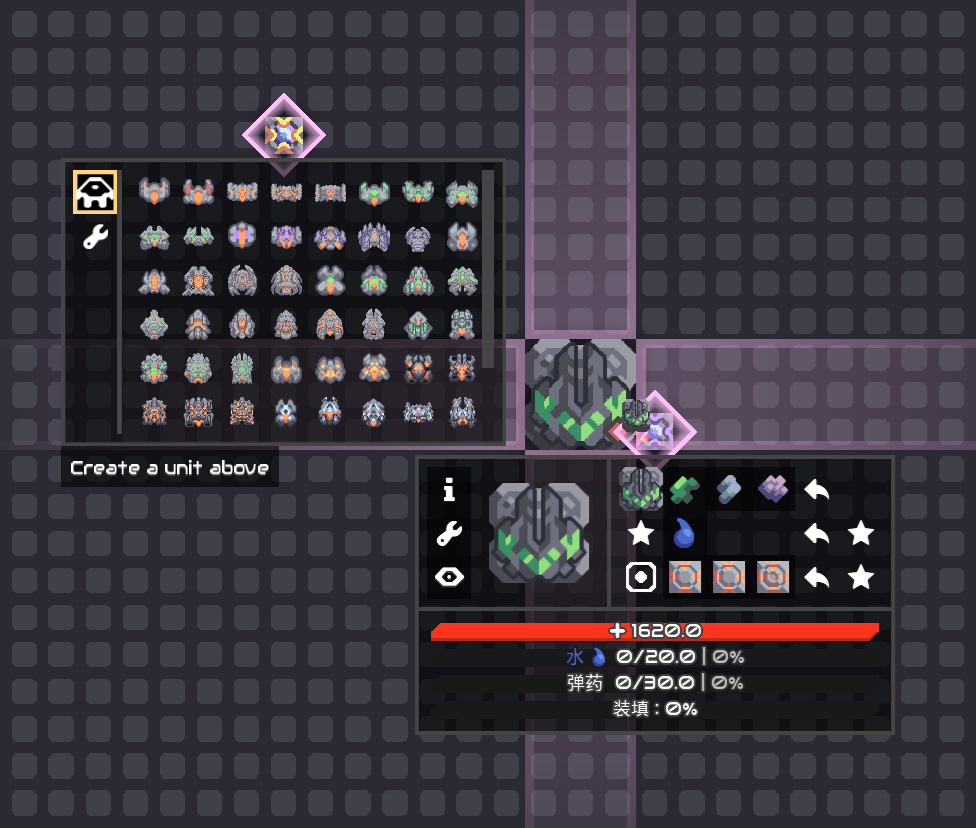
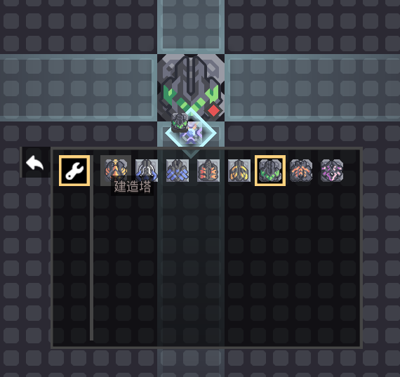

- 📌[Mindustry](https://github.com/Anuken/Mindustry)
- 📌[MindustryX](https://github.com/TinyLake/MindustryX)
- Subscribe to [NeilGreenFly](https://space.bilibili.com/1649414414) !

此模组是为解决在测试新版本建筑时频繁配置物品源等沙盒方块产生的繁琐操作，因此我们添加了无需配置的`AnySource`(任意源)， 它可以同时高速输出所有的物品种类、液体种类、载荷种类和相当于`heat-source`的热量，目前已几乎覆盖原版所有可能需要的消耗种类需求。

除此以外，为应对炮台对输入的多样化需求，我们添加了对炮台特化出来的`AmmoSource`(弹药源)，它允许配置适配当前炮台的弹药类型和强化、超速需求，可以随时更改、重置。

当然我们还添加了一些次要的建筑和装饰性建筑，这里就不一一赘述了。模组仍然处于开发阶段，这里仍然有很多不足，欢迎大家建言献策，再会！

### 2026 / 7 / 11

模组适配最低版本已提升至 159.2 ！弹药源现已更名为定向源`DirSource`，现在已经具备任意源的绝大部分功能！任意源现在可以在当前位置生成单位，相较于载荷源，这种轻便的生成方式会更适合临时的场景。我们已完成对代码的优化重构等阶段性任务，目前已基本满足测试的基本功能需求，后续更新速度会逐渐放缓，重心会移向BUG的修复和后续的优化。

---

---

## 注意

目前此模组暂不考虑版本间的兼容，因此如果您因更新此模组导致崩溃，请自行禁用此模组后进入存档以移除导致崩溃的建筑，此后可以重新启用模组。
如果出现了非版本不兼容(或因游戏更新导致字段失效等)的崩溃或BUG，可以向我们提交日志、问题及其复现方式。

相关问题可以提交至此 >> [点击加入群聊](https://qm.qq.com/q/ZfZKpzUzaU)

由于拦截不良账号的需要，在入群申请中请输入答案: `DeepSpace`

---

